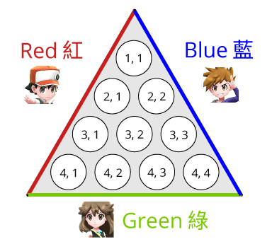
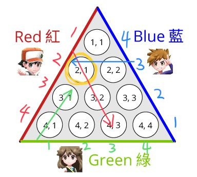
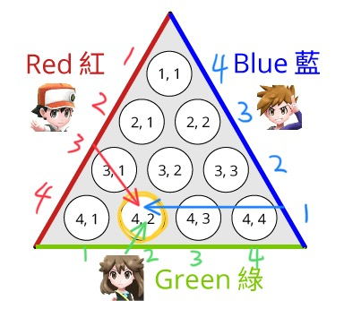

# Class 1
## Key Skills:
- Coding is mostly about managing complexity of your code.
- Keep it *dumb*. Optimize for development (most of the time). 
- Can you accurately assess your skill when confronting a problem, and thus assess the risk you're taking in each step of the way?
 
## Pyramid of OI
```
                          *****
                       ***********
                    * Convex Hull  *
                  *** Suffix Tree  ***
                ********* RMQ  *********
              *********** DSU  ***********
            ********* Graph Theory *********
          ******* Dynamic Programming ********
        ************ Data Structure ************
      ****** Divide & Conquer, Greedy, etc. ******
    ************ searching and sorting *************
  ***** Combinatorics, Logic and boolean algebra *****
***** Coding mechanics (loops, control flow, etc.) *****
```

## Coding Mechanics
- Takes a lot of work
- There is no shortcut
- If you cut corners here, you will pay the price
  - either you waste a lot of time in your training,
  - or you don't go as far as you deserve

1. Inspection Skills
2. Testing Skills
3. Workflow
4. Best Practices
5. Bad Habits
6. Bugs Hunting Script


## Analytical Skills
1. Drawing Skills (first on paper, then in your mind)
2. Pseudocode and algorithm design

---

# j212 Paint the Floor
## Problem Statement
<br>
<br>

__________________________

## Analyze sample tests
What are the takeaways from each sample tests?
1. __________________________
2. __________________________
3. __________________________

## [Brute force solution](https://github.com/miyagi-sensei/j212/blob/main/brute.cpp)
You may not need it in this case but it serves as a demonstration why brute force solution can be useful.<br>
Time Complexity: O(N<sup>2</sup> + Q)<br>
Space Complexity: O(N<sup>2</sup>)

### Coding best practices
1. Conform your code logic to problem convention (start row/column index from 1)
2. Why not *always* declare local varialbes i, j?
3. Use of constants to streamline testing
4. Always create test files for redirection

## [Full solution](https://github.com/miyagi-sensei/j212/blob/main/v1.cpp)
Insight: Each tile (x, y) can only be painted by 3 paint jobs. What are they?

<br>


> (R, x-y+1), (G, y), (B, N-x+1)

Time Complexity: O(P + Q)<br>
Space Complexity: O(N)

### Testing Skills
- code like function `print_wall()` can be super handy in the testing process

### Workflow
- try to write the easier part first and fill in the harder parts incrementally
- compile test frequently, incrementally. don't write too much code without testing
- `g++ code.cpp` compiles `code.cpp` into `a.out` (or `a.exe` on Windows PC)
- then `./a.out < in.txt` runs the program and redirects contents of `in.txt` as input

### Bad Habits
- some code is more prone to mistakes:
   - Using 1 big 2D array for paint jobs rank instead of 3 arrays (`PaintRank[][]` instead of `Red[], Blue[], Green[]`)
     - this creates the mental burden of remembering 0, 1, 2 corresponds to red, blue and green instead of red, green and blue => increases chance of mistakes
- typing input instead of redirecting from text files
   - typos increase chances for devastating confusion
   - eliminating these pitfalls streamline your development process

### What if we can't figure out what kind of cases our program fails?
> Most of the time *when* does it fail is a lot harder to find than fixing the bug itself

[stress test scripting](https://github.com/miyagi-sensei/j212/blob/main/stress.sh) and [random input generator](https://github.com/miyagi-sensei/j212/blob/main/gen.py) help us search for the point of failure, making it easier to pinpoint the bugs in the code.

### Inspection Skills
- Narrow down to the "R" case. Inspect all 3 values: `Red[ri], Blue[bi], Green[gi]`
- Know what you're expecting and ask why you're not getting what's expected
- If something goes wrong, don't spend too much time staring at the code. Inspect something quick to narrow the scope of your investigation.
  - e.g. print out arrays `Red[], Blue[], Green[]`

---

# Preview
We will go over a few more problems before we begin the real training
1. j213 
   - some brute force solutions are harder to write
   - using brute force solution to help analysis of the problem
2. s193
   - subtasking is your friend

---

# Homework
## Permutations
- Input: `N (2 ≤ N ≤ 10)`
- Generate all permutations of `N` numbers from `0` to `N-1`. The output for `N=9` would look like this (but not necessarily in this order:
```
0 1 2 3 4 5 6 7 8
0 1 2 3 4 5 6 8 7
0 1 2 3 4 5 7 6 8
0 1 2 3 4 5 7 8 6
...
8 7 6 5 4 3 2 0 1
8 7 6 5 4 3 2 1 0
```
- See [template](https://replit.com/@haye/dgs#permutations.cpp)
- [01031](https://judge.hkoi.org/task/01031) asks you to generate permutations in lexicographic order when there are duplicates, which is much harder. If you're up for a challenge, try it.

## Combinations
- Input: `N C` `(2 ≤ N ≤ 10, 1 ≤ C ≤ N)`
- Generate all the ways to choose `C` numbers from `0` to `N-1`. The output for `N=5, C=3` would look like this (but not necessarily in this order:
```
0 1 2
0 1 3
0 1 4
0 1 5
0 2 3
0 2 4
0 3 4
1 2 3
1 2 4
1 3 4
2 3 4
```
- See [template](https://replit.com/@haye/dgs#combinations.cpp)
- [01037](https://judge.hkoi.org/task/01037) asks you to generate combinations in lexicographic order when there are duplicates, which is much harder. If you're up for a challenge, try it.

