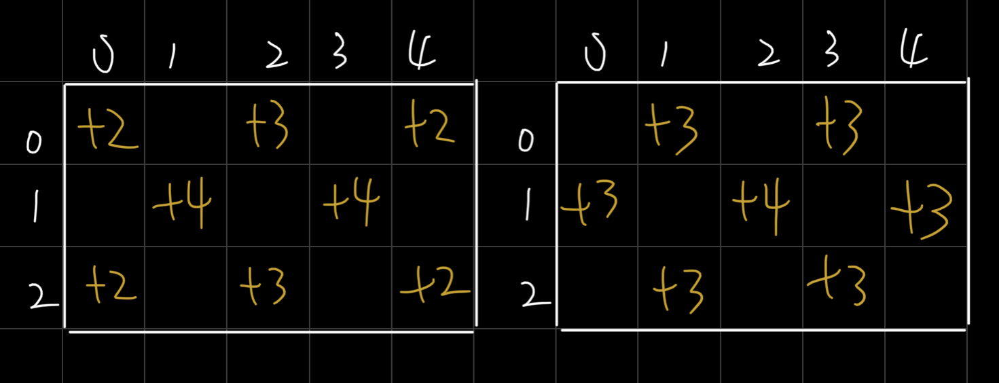

# Class 2
## Homework from last time
### Problem Statement Submissions
1. It's a tool for yourself. You don't write it for anybody else.
2. The problem statement that helps your development process the most is the best one. 
3. It's never finished. So feel free to edit it after submission.
4. Practice with this goal in mind: improve your ability to describe a problem with clarity

### Sample Test Analysis
This practice is to elevate your consciousness of your own thoughts and analysis.

### Permutations
Useful for brute force solution

### Combinations
Even more relevant for brute force solution

What about those who didn't submit homework? A dog ate it?

> ## Workflow review
> - try to write the easier part first and fill in the harder parts incrementally
> - compile test frequently, incrementally. don't write too much code without testing
> - `g++ code.cpp` compiles `code.cpp` into `a.out` (or `a.exe` on Windows PC). Sometimes `g++ -std=c++11 code.cpp` if you use C++11 syntax.
> - then `./a.out < in.txt` runs the program and redirects contents of `in.txt` as input

---

## j213 Paint the Wall
Please send me the problem statement and sample tests analysis over Discord.
### Problem Statement
  
__________________________

### Analyze sample tests
What are the takeaways from each sample tests?

1. __________________________
2. __________________________
3. __________________________
4. __________________________

### [Brute force solution](https://github.com/miyagi-sensei/j213/blob/main/brute.cpp)
The code you've written in the combinations homework is handy for the brute force solution.
Picking N out of 9 numbers is the same as picking N cells out of a 3x3 grid.
Picking N out of R * C numbers is the same as picking N cells out of a R x C grid.

### Subtask 1
Insight 1: To paint 5 cells black in a 1 x 7 white wall is the same as painting 2 cells white in a 1 x 7 black wall.
Write elegant wrapper around the problem based on this insight so you can reuse it in all subtasks.

### Subtask 2

### Subtask 4-5
Greedy goes pretty far

### Subtask 6
But as usual, greedy can lead you astray sometimes. You take one wrong turn early on and you missed the optimal solution forever. This happens when R x C is odd.
Think about `3 5 6` versus `3 5 7` as input.

### `bitset` exercise
Try to use `bitset` the represent the wall as an exercise. See [here](https://www.cplusplus.com/reference/bitset/bitset/?kw=bitset) for references on how to use `bitset`. 

## Risk Management
### Value of Brute force solution:
- helps you come up with insight and ideas
- if you are only interested in the ingenious solution, 
