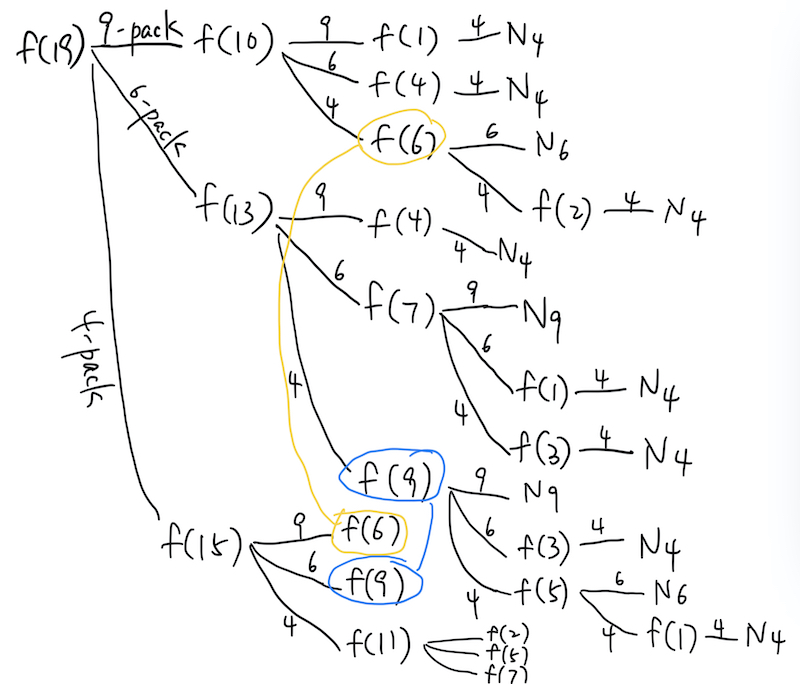

# Class 3
## Homework from last time
### `^` : `xor` operator flips a bit
|A|B|A ^ B
|---|---|---
|false|false|false
|true|false|true
|false|true|true
|true|true|false
> When B is false, it leaves A unchanged. When B is true, it "flips" A to the opposite. You can use `^` when you print the wall.

### `bitset` refactoring
declare `bitset<101> wall[101]` instead of `bool wall[101][101]` and that's it!

### Optimize for development time
- During competition, your priority is to optimize for development time, although that's not necessarily a good way to practice.
- Would this approach be easier to write, i.e. more optimized for development time?

## Recursion
[D205 Prime factorization](https://judge.hkoi.org/task/D205) can be solved recursively. It's an important way of solving a problem in computer science. You may be able to solve it in many ways but the recursive way is instructive.
```
def factorize(n):
    for i in range(2, int(n**0.5)+1):
        if n % i == 0:
            return [i] + factorize(n // i)
    return [n]

N = int(input())
print(factorize(N))
```

### Sample solutions in C++
- [recursive implementation](https://github.com/miyagi-sensei/d205/blob/main/v2.cpp)
- [iterative implementation](https://github.com/miyagi-sensei/d205/blob/main/v1.cpp)

But more important is the formulation of prime factorization:

- f(n): prints all prime factors of `n`
- if `k` is a prime factor of `n`, then<br>
    f(n) = prints "k " and call f(n / k)
- if `n` has no factor (i.e. it's prime), then<br>
    f(n) = prints "n"
- Note the smallest factor of `n` happens to be a prime factor

This is called the recursive definition of a problem.
> Recursion is a way of defining a problem in terms of *a simpler version* of itself.

The ability to define a problem recursively is powerful for many OI problems.
This is sometimes called a **transition equation** in Dynamic Programming context.

Where else have we seen this recursive formulation of a problem?
### [Fibonacci Numbers d201](https://judge.hkoi.org/task/D201) 
- f(n) = f(n-1) + f(n-2)<br>
- f(0) = 0<br>
- f(1) = 1

## [j181 Wings and Nuggets](https://judge.hkoi.org/task/J181)
Given: W<sub>4</sub> > W<sub>2</sub>, N<sub>9</sub> > N<sub>6</sub> > N<sub>4</sub>
### Subtask 1 Problem Statement:
- minimize X<sub>2</sub>\*W<sub>2</sub> + X<sub>4</sub>\*W<sub>4</sub>
- constraint: 2\*X<sub>2</sub> + 4\*X<sub>4</sub> ≥ X

solution: can use greedy approach. check whether W<sub>2</sub> or W<sub>4</sub> has the lowest unit cost and the proceed accordingly.

### Subtask 2 Problem Statement:
- maximize 2\*X<sub>2</sub> + 4\*X<sub>4</sub>
- constraint: X<sub>2</sub>\*W<sub>2</sub> + X<sub>4</sub>\*W<sub>4</sub> ≤ Y

solution: can use greedy approach. first buy the packs with the lowest unit cost then see if there's any money left to buy another 2-pack.

### Subtask 3 Problem Statement:
- minimize X<sub>4</sub>\*N<sub>4</sub> + X<sub>6</sub>\*N<sub>6</sub> + X<sub>9</sub>\*N<sub>9</sub>
- constraint: 4\*X<sub>4</sub> + 6\*X<sub>6</sub> + 9\*X<sub>9</sub> ≥ X

Can we use the greedy approach?

In Sample Test 3 (N<sub>4</sub> = 14, N<sub>6</sub> = 21 and N<sub>9</sub> = 27), if `X = 10` or `X = 19`, we have a problem. Even though N<sub>9</sub> has the lowest unit cost, buying a 9-pack lead you astray. 
> Sometimes you have to choose to do what is suboptimal in the short term in order to get the optimal outcome in the long term.

You have to try all possibilities. (brute force?)


- f(X): the cheapest way to buy at least X nuggets
- f(X) = min( N<sub>4</sub>+f(X-4), N<sub>6</sub>+f(X-6), N<sub>9</sub>+f(X-9) )
- primtives: for X ≤ 0, f(X) = 0

> it performs lots of redundant search down the tree but because `X` is small, a naive brute force search would score the subtask.

Implementation:
```
int f(int x) {
    if (x <= 0)
        return 0;
    int cost1 = N4 + f(x - 4);
    int cost2 = N6 + f(x - 6);
    int cost3 = N9 + f(x - 9);
    return min(cost1, min(cost2, cost3));
}
```

### Memoization (unnecessary optimization for subtask 3):
```
int min_cost[101];    // memoization table

int f(int x) {
    if (x <= 0) {
        return 0;
    }
    if (min_cost[x] != 0) {
        return min_cost[x];
    }
    int cost1 = N4 + f(x - 4);
    int cost2 = N6 + f(x - 6);
    int cost3 = N9 + f(x - 9);
    min_cost[x] = min(cost1, min(cost2, cost3));
    return min_cost[x];
}
```
Most of the time you would need to initialize the memoization table to *impossible value* like `-1` to avoid collision. In this example it's not necessary but this is the exception to the rule.

### Subtask 4 Problem Statement:
- maximize 4\*X<sub>4</sub> + 6\*X<sub>6</sub> + 9\*X<sub>9</sub>
- constraint: X<sub>4</sub>\*N<sub>4</sub> + X<sub>6</sub>\*N<sub>6</sub> + X<sub>9</sub>\*N<sub>9</sub> ≤ Y

Formulation:
- g(Y): the most nuggets Y dollars can buy
- g(Y) = max( 4+g(Y-N<sub>4</sub>), 6+g(Y-N<sub>6</sub>), 9+g(Y-N<sub>9</sub>) )??
    need to make sure you don't go buy a pack of nuggets if you don't have the money
- primtives: ???

---

# Homework (Optional)
- [j181 Wings and Nuggets](https://judge.hkoi.org/task/J181)
- Extra Credit: [More Fibonacci Sequence Exercise](https://judge.hkoi.org/task/M1323) - not exactly related to recursive formula but a fun brain-teaser nonetheless
